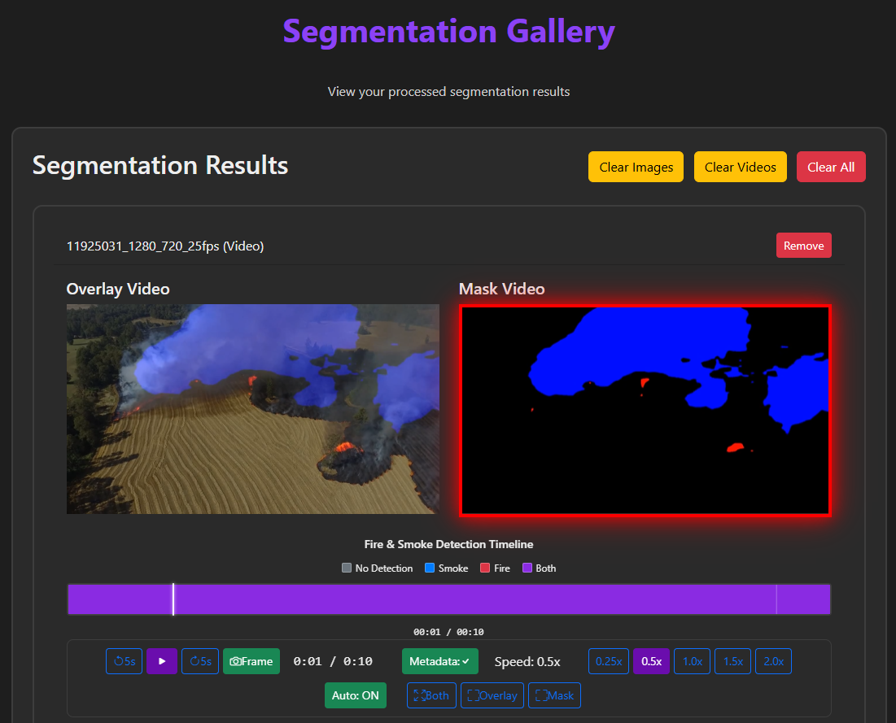
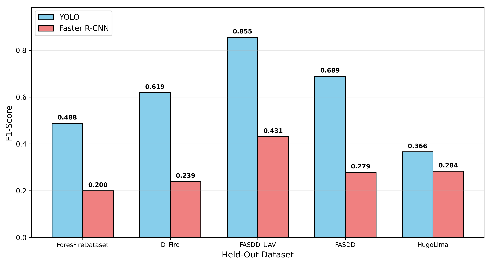

# FireTools: Integrated Tools for Enhanced Wildfire Detection and Segmentation

<div align="center">

**Master's Thesis Project — Instituto Superior Técnico (IST), Universidade de Lisboa**

<div align="center">

[](https://filipetendeiro.github.io/FireTools/)


</div>

---

## What is FireTools?

FireTools is a web-based platform that enables firefighting teams to upload RGB video footage from UAVs or surveillance towers and receive automated fire and smoke analysis. No technical expertise is required to operate it.

The system combines two deep learning models:

- **FireDetect** — YOLOv8n (nano, 3.2M parameters) for real-time bounding-box detection at 82.7 FPS
- **FireSeg** — Hybrid DeepLabv3+ with YOLO-guided smoke enhancement (26.7M parameters) for pixel-level segmentation at 30.6 FPS

Both models were trained and evaluated across 121,454 training images (detection) and 2,471 images (segmentation) from multiple wildfire datasets.

---

## Repository Structure

This repository contains two independent, self-contained applications:

```
GitHub/
├── FireTools_Windows/    # Windows version (Python launcher, PowerShell)
├── FireTools_Linux/      # Linux/macOS version (python3, bash)
└── images/               # Interface and results figures
```

### Why two folders?

The core application code is identical. The two versions differ only in how they are installed and run:

<div align="center">

|                     |      FireTools_Windows        |      FireTools_Linux         |
|---------------------|-------------------------------|------------------------------|
| **Target OS**       |         Windows 10/11         | Ubuntu 20.04+, Debian, macOS |
| **Python command**  |           `py -3.11`          |           `python3`          |
| **Venv activation** | `.venv\Scripts\Activate.ps1`  |  `source .venv/bin/activate` |
| **Shell**           |           PowerShell          |             bash             |
| **Setup guide**     |      `SETUP_WINDOWS.md`       |        `LINUX_SETUP.md`      |

</div>

Having separate folders avoids cross-platform confusion and lets each version have its own setup guide, path separators, and shell commands without any conditional logic.

---

## Interface

### Upload & detection

Choose files, upload, and run detection. Processing tasks appear with status (processing/completed). Navigate to the Detection Gallery to view results.

<div align="center">
  
</div>

### Detection gallery

Browse detection results with side-by-side original and annotated videos. **Clear Images**, **Clear Videos**, or **Clear All** to remove results. The color-coded timeline shows fire (pink), smoke (purple), and no detection (blue). Playback controls: play/pause, skip ±0.5s or ±5s, speed (0.25×–2×), and loop.

<div align="center">
  
</div>

### Segmentation gallery

Browse segmentation results with overlay (mask on video) and mask-only views. Same timeline and playback controls as the detection gallery. Use **Start Segmentation** from a detection item to run segmentation on it.

<div align="center">
  
</div>

---

## Quick Start

### Windows

```powershell
# 1. Install dependencies
winget install --id Python.Python.3.11 -e
winget install --id Gyan.FFmpeg -e

# 2. Clone and enter folder
git clone https://github.com/FilipeTendeiro/FireTools.git
cd FireTools/FireTools_Windows

# 3. Create virtual environment
py -3.11 -m venv .venv
.venv\Scripts\Activate.ps1

# 4. Install PyTorch (GPU — CUDA 12.1)
python -m pip install torch torchvision torchaudio --index-url https://download.pytorch.org/whl/cu121

# 5. Install remaining dependencies
python -m pip install -r requirements.txt

# 6. Run
cd scripts
py -3.11 app.py
```

For the full step-by-step guide see **[FireTools_Windows/SETUP_WINDOWS.md](FireTools_Windows/SETUP_WINDOWS.md)**

### Linux / macOS

```bash
# 1. Install dependencies (Ubuntu/Debian)
sudo apt-get update && sudo apt-get install python3 python3-pip python3-venv ffmpeg

# 2. Clone and enter folder
git clone https://github.com/FilipeTendeiro/FireTools.git
cd FireTools/FireTools_Linux

# 3. Create virtual environment
python3 -m venv .venv
source .venv/bin/activate

# 4. Install PyTorch (GPU — CUDA 12.1)
pip install torch torchvision torchaudio --index-url https://download.pytorch.org/whl/cu121

# 5. Install remaining dependencies
pip install -r requirements.txt

# 6. Run
cd scripts
python3 app.py
```

For the full step-by-step guide see **[FireTools_Linux/LINUX_SETUP.md](FireTools_Linux/LINUX_SETUP.md)**

---

Open **http://localhost:8000** in your browser once the server is running.

---

## Models

Both folders include the same pre-trained models under `models/` (tracked via Git LFS):

<div align="center">

|         File         |   Size  |                    Purpose                   |
|----------------------|---------|----------------------------------------------|
| `best.pt`            |    6 MB | YOLOv8n — fire and smoke detection           |
| `best_deeplabv3.pth` |  103 MB | Hybrid DeepLabv3+ — pixel-level segmentation |

</div>

The detection model was trained on 121,454 images from ForesFireDataset, D-Fire, FASDD_UAV, and FASDD. The segmentation model was trained on 2,471 images across Corsican Fire, FireFront-Gestosa, GP Fire, HugoLima, and LK Smoke datasets.

---

## Performance

### Detection

YOLOv8n runs at 82.7 FPS and outperforms Faster R-CNN on F1-score (0.603 vs 0.287). Faster R-CNN has higher mAP but around 80% false positives, which limits practical use.

<div align="center">
  
</div>

<div align="center">

|   Architecture  | Precision | Recall | F1-Score  | mAP@0.5 |    FPS   |
|-----------------|-----------|--------|-----------|---------|----------|
| **YOLOv8n**     |   0.675   |  0.553 | **0.603** |  0.590  | **82.7** |
| Faster R-CNN    |   0.192   |  0.629 |   0.287   |  0.698  |   15.0   |

</div>

### Segmentation

The hybrid DeepLabv3+ with YOLO Smoke guidance gives the best smoke IoU (0.525) while keeping fire accuracy (0.627), with 85.1% smoke detection rate.

<div align="center">
  
</div>

<div align="center">

|        Method         | Fire IoU | Smoke IoU | Smoke Detection Rate |  FPS  |
|-----------------------|----------|-----------|----------------------|-------|
| DeepLabv3+            |  0.627   |   0.474   |        72.3%         |  33.3 |
| EfficientSeg          |  0.615   |   0.480   |        76.2%         |  38.5 |
| DLV3+ + Color + YOLO  |  0.594   |   0.516   |        85.1%         |  12.9 |
| **DLV3+ + YOLO Smoke**| **0.627**| **0.525** |      **85.1%**       |  30.6 |

</div>

### Example outputs for the diferent methods

<div align="center">
  
</div>

### Reliability

98.7% of 150 videos processed successfully. Manual review time reduced by 87% (45,000 frames: 15 min → 2 min).

---

## Requirements

- Python 3.11 (Windows) / Python 3.8+ (Linux)
- FFmpeg
- 8 GB RAM minimum, 16 GB recommended
- NVIDIA GPU with 4 GB+ VRAM recommended (CUDA 12.1); CPU fallback supported

---

## Citation

If you use FireTools in your research, please cite:

```
Tendeiro, F. M. (2025). FireTools: A Web-Based Platform for Wildfire Detection
and Segmentation Using Deep Learning. MSc Thesis, Instituto Superior Técnico,
Universidade de Lisboa.
```

---

## Acknowledgments

- [Ultralytics YOLOv8](https://github.com/ultralytics/ultralytics) — detection backbone
- [segmentation-models-pytorch](https://github.com/qubvel/segmentation_models.pytorch) — DeepLabv3+ implementation
- [FastAPI](https://fastapi.tiangolo.com/) — web backend
- IST / Universidade de Lisboa — institutional support

---

## Contributing

Issues and pull requests are welcome. Please open an issue before submitting substantial changes.

---

## Contact

- **Filipe Martins Tendeiro** (corresponding): [filipetendeiro@proton.me](mailto:filipetendeiro@proton.me)
- **Nuno Pessanha Santos**: [nuno.pessanha.santos@tecnico.ulisboa.pt](mailto:nuno.pessanha.santos@tecnico.ulisboa.pt)
- **Alexandre Bernardino**: [alexandre.bernardino@tecnico.ulisboa.pt](mailto:alexandre.bernardino@tecnico.ulisboa.pt)

Or open a [GitHub issue](https://github.com/FilipeTendeiro/FireTools/issues).

---

## Project Website

A full presentation of this project is available at **[filipetendeiro.github.io/FireTools](https://filipetendeiro.github.io/FireTools/)**.
